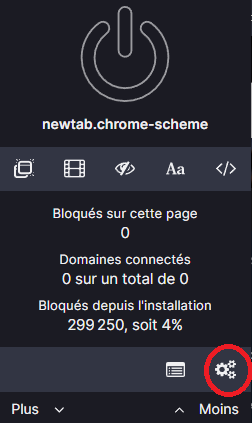
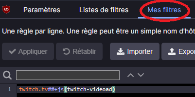
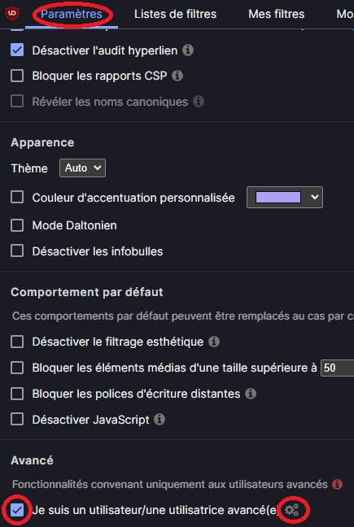
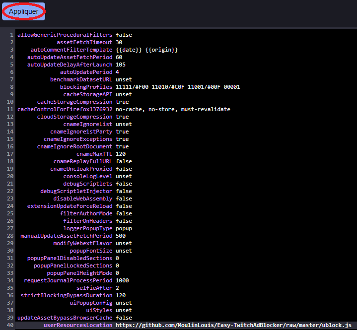

# Easy TwitchAdBlocker

One easy solution to block Twitch Ads using [uBlock Origin](https://ublockorigin.com/).

## Putting a script in uBlock Origin

1. Access uBlock Origin settings dashboard

2. Under `My filter` , write `twitch.tv##+js(twitch-videoad)`

3. Under `Settings`, on the `Advanced` section, check the `I am an advanced user` checkbox, then click on the gearing that appear

4. Modify the value of userResourcesLocation from unset to `https://github.com/MoulinLouis/Easy-TwitchAdBlocker/raw/master/ublock.js` and click on the `Apply` button

5. You're done, enjoy https://www.twitch.tv/

## Translation

| Language | Status | Link |
|---|---|---|
| French | Done | [link](https://github.com/MoulinLouis/Easy-TwitchAdBlocker/raw/master/fr-FR/) |
| Spanish | Todo | [link]() |
| Deutch | Todo | [link]() |