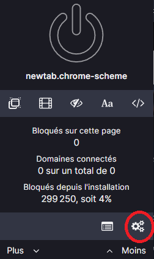
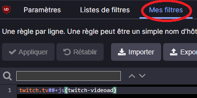

# Easy TwitchAdBlocker

Une solution simple pour bloquer les publicités Twitch en utilisant [uBlock Origin](https://ublockorigin.com/fr/)

## Putting a script in uBlock Origin

1. Accéder au tableau de bord des paramètres d'uBlock Origin

2. En dessous de `Mes filtres`, écrit `twitch.tv##+js(twitch-videoad)`

3. En dessous de `Paramètres`, dans la section `Avancés`, cochez la case `Je suis un utilisateur avancé`, puis cliquez sur les engrenages qui apparaissent.

4. Modifiez la valeur de userResourcesLocation de unset à `https://github.com/MoulinLouis/Easy-TwitchAdBlocker/raw/master/ublock.js` et cliquez sur le bouton `Appliquer`.

5. C'est bon, profite de https://www.twitch.tv/